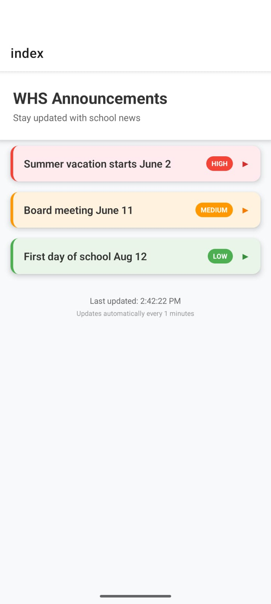

# WHS Announcements App

## Installation

1. Install dependencies:

   ```bash
   npm install
   ```

2. Start the app:

   ```bash
   npx expo start
   ```

This will open the Expo Developer Tools in your browser. You can run the app on a physical device using Expo Go or on an emulator/simulator.

## Home Page


